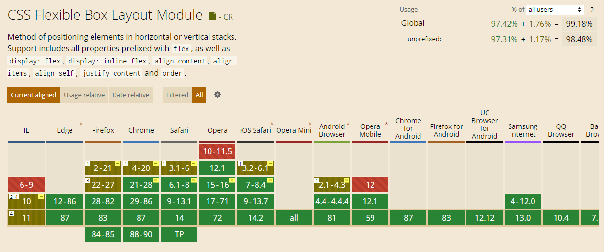
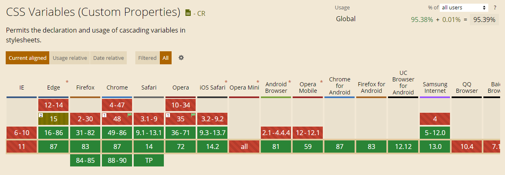
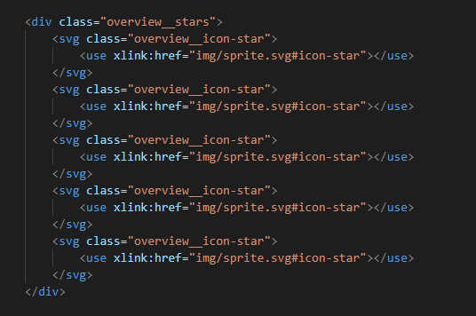

# Trillo - A Flexbox Project

This is the second project from the [Jonas Schmedtmann's Advanced CSS and Sass course.](https://www.udemy.com/advanced-css-and-sass/ "Udemy | Advanced CSS and Sass: Flexbox, Grid, Animations and More!") Main goal of this project was to build a responsive landing page by using the **Flexbox CSS layout method**.

## Table of Contents

- [Flexbox](#flexbox)
- [CSS custom properties (variables)](#css-custom-properties-variables)
- [SVG icons vs. Icon fonts](#svg-icons-vs-icon-fonts)

## Flexbox

Flexbox is a one-dimensional layout method for laying out items in rows or columns. The main idea behind the flexbox is to give the container, a parent element with `display: flex` property the ability to expand children elements to fill available free space or shrink them to prevent overflow, and thus best utilize the available space. Also, children elements order can easily be rearranged by using the CSS `order` property.

As stated on the [MDN Flexbox Page](https://developer.mozilla.org/en-US/docs/Learn/CSS/CSS_layout/Flexbox), some of the best use cases of flexbox layout are:

> - Vertically centering a block of content inside its parent.
> - Making all the children of a container take up an equal amount of the available width/height, regardless of how much width/height is available.
> - Making all columns in a multiple-column layout adopt the same height even if they contain a different amount of content.

Flexbox is supported in all major browsers except IE 9 and lower. *[See browser support on caniuse.com website.](https://caniuse.com/?search=flexbox "Can I use flexbox?")*

## CSS custom properties (variables)

>**Custom** properties (sometimes referred to as **CSS variables** or **cascading variables**) are entities defined by CSS authors that contain specific values to be reused throughout a document.
*[Source: MDN](https://developer.mozilla.org/en-US/docs/Web/CSS/Using_CSS_custom_properties "Using CSS custom properties (variables)")*

They are usually defined in the `:root` CSS pseudo-class which represents the `<html>` element and is identical to the selector `html`, except that its specificity is higher.

We can easily access those CSS variables anywhere by using the `var()` function: `color: var(--color-primary);`

Some of the main reasons to use native CSS variables instead of SASS variables as mentioned on [CSS-TRICKS website](https://css-tricks.com/difference-between-types-of-css-variables/ "What is the difference between CSS variables and preprocessor variables?") include:

> - You can use them **without the need of a preprocessor**.
> - **They cascade.** You can set a variable inside any selector to set or override its current value.
> - When their values change (e.g. media query or other state), **the browser repaints as needed**.
> - You can access and **manipulate them in JavaScript**.

Another interesting article on this topic by codyhouse.co: [Why we prefer CSS Custom Properties to SASS variables](https://codyhouse.co/blog/post/css-custom-properties-vs-sass-variables).

CSS variables are not supported in IE browsers. *[See browser support on caniuse.com website.](https://caniuse.com/?search=variables)*

## SVG icons vs. Icon fonts

One major advantage of SVG icons over Icon fonts is their superior accessibility. They have a lot of built in elements like `<title>` and `<desc>` which makes them accessible to screen readers. Also, SVG allows us to have multicolored icons and wide variety of animation options. SVGs are treated as images by browsers and are easier to position. On the other hand, Icon fonts are inserted using pseudo-elements and their positioning is sometimes challenging. They may also encounter occasional failures. However, Icon fonts enjoy better cross browser compatibility. [See more in this great article by LambdaTest](https://www.lambdatest.com/blog/its-2019-lets-end-the-debate-on-icon-fonts-vs-svg-icons/) or [TLDR version on CSS-Tricks website](https://css-tricks.com/icon-fonts-vs-svg/)

This project uses SVG sprite generated through [icomoon.app](https://icomoon.io/). SVG icons are then easily displayed with the help of `<use>` element:

Also, one neat trick when using SVG icons in navigation links is that we can set their `fill` property to `currentColor`, which means that they will inherit the color of the parent element. When parent color changes, SVG color changes as well:

SVG is supported in all major browsers and IE9+ (with a couple of known issues). *[See browser support on caniuse.com website.](https://caniuse.com/?search=svg)*

